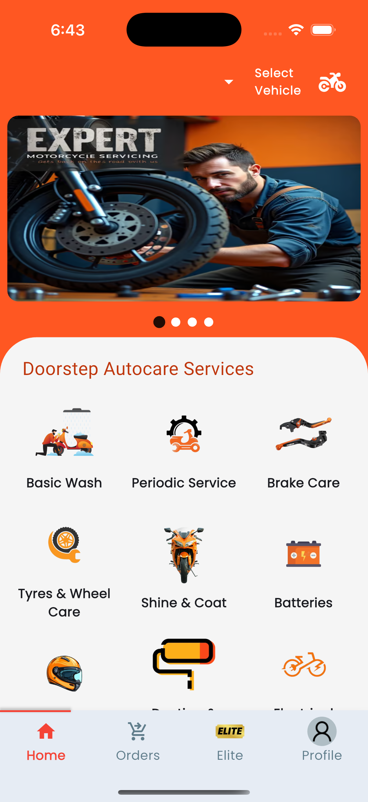
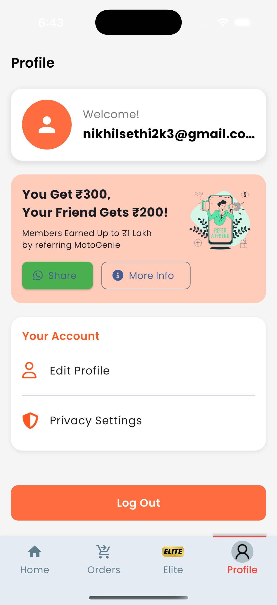

# MotoGenie_app

A Flutter-based motorcycle service application designed to provide users with seamless access to motorcycle-related services, subscriptions, and premium features. This cross-platform app supports both **Android** and **iOS** devices.

---

## About MotoGenie_app

MotoGenie_app is a dynamic Flutter application aimed at motorcycle enthusiasts and service users. It offers an intuitive interface for service bookings, vehicle management, profile handling, and premium access. The app integrates clean design, reusable components, and stateful widgets to deliver a modern user experience.

This project is a **collaborative team effort**, managed and developed using **GitHub for version control and collaboration**.

---

## ✨ Features

- 🏠 Designed and implemented the **Home Screen UI** with services grid, banner carousel, and vehicle selection.
- 👤 Built the **Profile Screen UI** with user info, refer & earn card, and account settings layout.
- 🧭 Integrated both screens into the **bottom navigation** flow of the app.
- 📱 Focused on **modern UI/UX**, responsiveness, and reusable components.
- 🛠️ Followed **Flutter best practices** for a clean and scalable project structure.

---

## 🛠️ Tech Stack

| Technology           | Description                                             |
| -------------------- | ------------------------------------------------------ |
| **Flutter**          | Cross-platform UI toolkit for natively compiled apps supporting Android & iOS |
| **Dart**             | Programming language optimized for UI                   |
| **Flutter Widgets**  | For responsive, interactive, and reusable UI components|
| **Git & GitHub**     | Version control and team collaboration                   |

---

## 🧑‍💻 Contributions / What I worked on

- 🏠 Developed the **Home Screen** UI:
  - Custom top bar with vehicle selection dropdown.
  - Dynamic service grid for bookings like Basic Wash, Brake Care, etc.
  - Carousel banner and scrollable layout with modern visuals.
- 👤 Created the **Profile Screen** UI:
  - Welcome card showing user email.
  - Refer & Earn card with share options.
  - Account options like Edit Profile, Privacy Settings, and Logout.
- 🔄 Integrated both screens into the app’s **bottom navigation bar**.
- 🎯 Maintained a visually clean and responsive design.
- 🛠️ Ensured code modularity and readability.

---

## 📸 Screenshots

<p align="center">
   &nbsp;&nbsp;
  
</p>

---

## 🚀 Getting Started

1. **Clone the repository:**

    ```bash
   git clone https://github.com/whonikhilsethi/motogenie-bike-service-app-flutter.git
cd motogenie-bike-service-app-flutter

    ```

2. **Install dependencies:**

    ```bash
    flutter pub get
    ```

3. **Run the app:**

    ```bash
    flutter run
    ```

---

## 📧 Contact

For any questions or collaboration, feel free to reach out via email: **nikhilsethi2k3@gmail.com**

---

## 📚 References and Resources

- [Flutter Documentation](https://docs.flutter.dev/)
- [Dart Language Guide](https://dart.dev/guides)
- [GitHub Docs](https://docs.github.com/en)
- [Flutter UI Best Practices](https://flutter.dev/docs/development/ui/overview)

---
